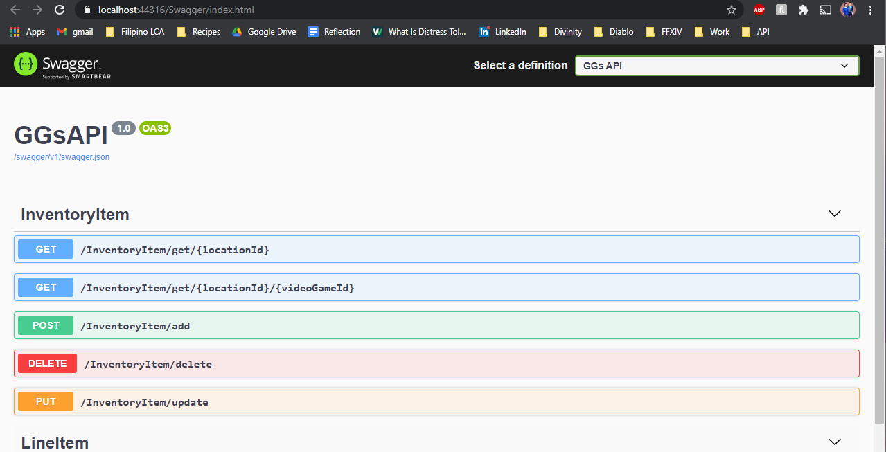
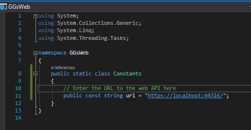
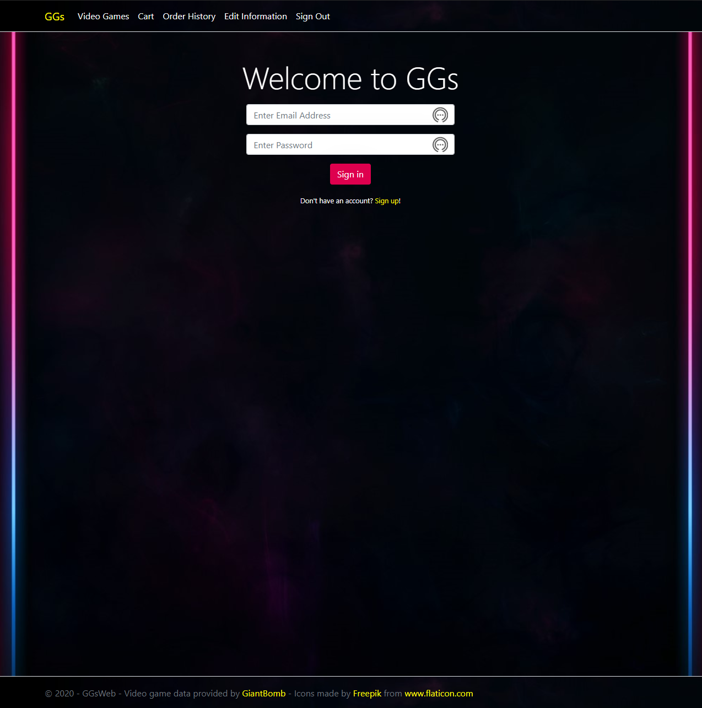
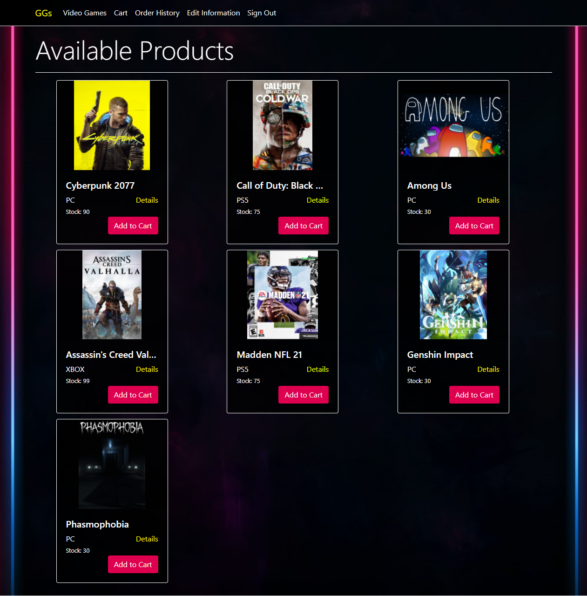
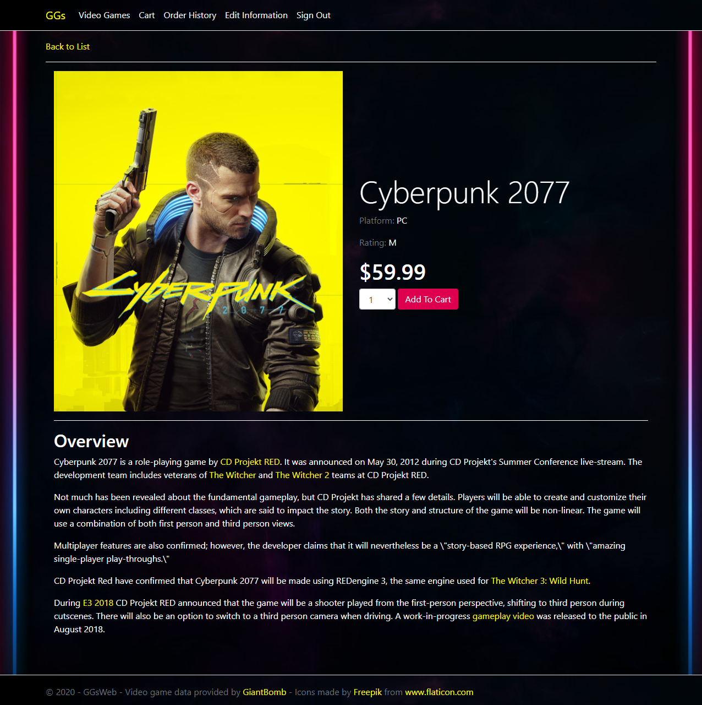
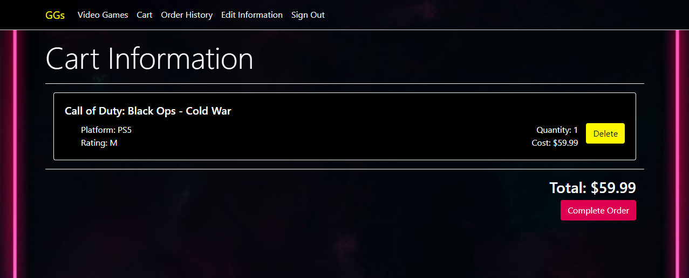
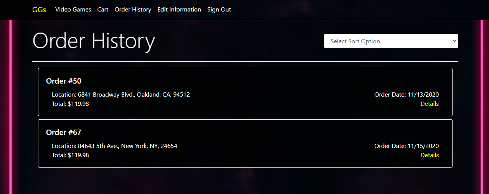

# GGs Store App

## Project Description
This application is designed with functionality that would make virtual shopping much simpler! Customers can sign up for an account, place orders, view their order history, and specific location inventory. It also comes with an additional interface for managing your business. Managers can view and replenish location inventory, add new products, and view the order history of specific locations. This application used Entity Framework Core to connect to a PostgreSQL database, ASP.NET Core API to create a RESTful API, and HTML, CSS, BootstrapJS, and Javascript to create the front end.

## Technologies Used
- ASP.NET Core - version 5.6.3
- .NET Core - version 3.1
- EntityFrameworkCore - version 3.1.9
- Serilog - version 2.10.0
- Postgre SQL - version 3.1.4
- XUnit - version 2.4.0

## Features
Ready features
- Customer sign up 
- Customer can place orders and view order history
- Customer van view location inventories
- Customer can purchase multiple products at once
- Manager can view location order history
- Manager can replenish inventory
- Manager can add new product
- Order histories have option to be sorted by date and cost, ascending and descending

To-do:
- Add different type of product available for purchase
- Add Auth0 authentication
- Improve data retreival speed 

## Getting Started
To get started:
- Clone the project using the following command in the command line: 
  `git clone https://github.com/jjennings510/GGsStoreApp.git`
- Open `GGsApp` folder and open `GGsApp.sln` file in Visual Studio
- Open `GGsAppREST` folder and open `GGsAppREST.sln` file in Visual Studio
- Build both solutions using the Build menu in Visual Studio
- Start `GGsAppREST.sln` and this page should show up
  

- Copy the url up to Swagger (i.e. https://localhost:44316/ in the picture above)
- In the GGsWeb Project, set the `url` variable in the `Constants.cs` class to the url of the `GGsAppREST.sln` project as pictured below

- Start the `GGsApp.sln`, you should see the following website appear

## Usage
- First, create an account by clicking on the 'Sign up' button
- This should bring you to the inventory page

- Click 'Add to Cart' to add a single product to the cart
- Click 'Details' to view the video game details and add multiple copies to cart

- Use the Nav Bar to navigate to your cart or view order history

- To sign in as a manager, use the following credentials
  **email**: jjennings@gmail.com
  **password**: admin
## License
This project uses the following license: MIT
